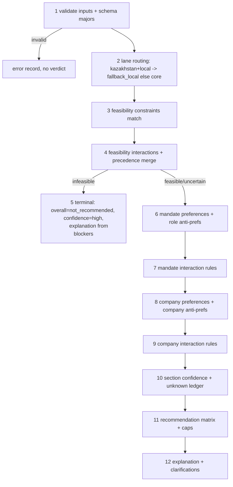

# Shadow Evaluator — Decision Source of Truth (v1.0.0)

**Статус:** канонический decision-контракт Step 3. Runtime evaluator НЕ
реализован; этот документ + `job_intel/shadow_evaluator/decision-contract.yaml`
— единственное место, где живёт продуктовая политика решений. Будущий
implementation-агент транслирует контракт в код и не изобретает семантику.
**Входы:** Career Preference Model v1.x (Step 1) + Vacancy Understanding v1.x
(Step 2). **Изменения** — только с owner approval (process SoT §8), no silent
learning.

## 1. Четыре выхода

```yaml
feasibility:      {verdict: feasible|uncertain|infeasible, lane: core|fallback_local, blockers: [], clarifications: []}
mandate_fit:      {band: exceptional|strong|moderate|weak|mismatch|unknown, supports: [], concerns: [], confidence}
company_fit:      {band: exceptional|strong|moderate|weak|mismatch|unknown, supports: [], concerns: [], confidence}
overall:          {recommendation: exceptional|strong|promising|unclear|not_recommended,
                   confidence: high|medium|low|unknown, applied_caps: [], lane}
```

Блоки раздельны на всём пути; overall выводится ТОЛЬКО из них через матрицу
§7 + caps §8 — никогда независимо. Feasibility — не скор и не предпочтение.

**Mapping к словарю process SoT §4** (для будущей поправки; см. review
report, owner decision O1): exceptional→apply, strong→apply,
promising→investigate/save (по confidence: medium+→investigate, low→save),
unclear→investigate(clarify), not_recommended→reject; exploration —
отдельный маркер, не label.

## 2. Decision graph



Пер-узловые свойства:

| Узел | Вход | Выход | Terminal | Evidence | Confidence-эффект | Failure |
|---|---|---|---|---|---|---|
| 1 validate | оба SoT-документа | ok/err | err terminal (без вердикта) | — | — | unsupported major → error record |
| 2 lane | feasibility_facts.country_group, local_market_indicator | lane | нет | structured/deterministic | нет | unknown country_group → lane core + clarification |
| 3–4 feasibility | constraints Step 1 × facts Step 2 | verdict+blockers | infeasible → terminal (5) | каждый matched rule цитирует fact evidence | unknown-политика §5 | правило без факта → правило не матчится (unknown ≠ false) |
| 6–7 mandate | prefs/anti role-level | band+supports/concerns | mismatch НЕ terminal (доходит до матрицы, где → not_recommended) | support/concern без evidence запрещён | §9 | отсутствие фактов → band unknown |
| 8–9 company | prefs/anti company-level | band | нет | то же | §9 | то же |
| 10 | все Fact.confidence + unknown ledger | секционные confidence | нет | — | §9 | — |
| 11 | verdicts+bands+confidence+lane | recommendation+caps | terminal | — | overall confidence §9 | непокрытая комбинация невозможна (полная матрица) |
| 12 | trace | explanation+clarifications | terminal | каждый item → evidence_refs | — | пункт без evidence отбрасывается с warning |

Инвариант терминальности: единственный ранний выход — infeasible (узел 5).
Mismatch mandate/company не прерывает граф — company_fit и объяснения всё
равно вычисляются (нужны для replay-аналитики), но матрица даёт
not_recommended.

## 3. Precedence

### 3.1 Verdict merge (feasibility)

`infeasible > uncertain > feasible`. Все matched constraints собираются;
итог — худший verdict ПОСЛЕ применения interactions/overrides. **Lane
независим от verdict**: KZ local всегда lane=fallback_local; unknown
sponsorship не делает KZ-роль uncertain (Step 1 инвариант, повторён здесь).
Override (`override.allowed=true`) применяется только при выполнении его
`conditions` и фиксируется в trace; overridden rule остаётся видимым.

### 3.2 Rule precedence

1. Порядок стадий графа (§2) — стадию нельзя «перепрыгнуть».
2. Внутри стадии interaction rules применяются по возрастанию `priority`
   (меньше = раньше), ровно один раз (идемпотентность), и **later rules не
   могут отменить эффект earlier rules** (no reversal: suppressed остаётся
   suppressed). Конфликт двух эффектов на один target → применяется более
   ранний по priority; второй фиксируется в trace как `skipped_conflict`.
3. YAML-позиция списков НЕ несёт семантики; только `priority`.
4. Категориальный порядок силы внутри стадии: feasibility constraint >
   interaction rule targeting it > strong anti-preference > soft
   anti-preference > preference support > exploration marker.

### 3.3 Evidence precedence

`explicit_statement > structured_source_field > deterministic_derivation >
semantic_inference > title-only inference`. `company_enrichment` ранжируется
как semantic_inference с обязательным внешним источником.
`manual_gold_annotation` — тестовая истина, в runtime-продакшене недопустима
как evidence. Конфликт двух фактов: побеждает высший уровень; при равном
уровне — конфликт не разрешается: значение → unknown + risk
`internal_contradiction` + clarification.

## 4. Blocker / concern / support

| Тип | Определение | Suppressible | Overridable | Влияние на confidence | Агрегация |
|---|---|---|---|---|---|
| blocker | matched feasibility constraint (verdict≠feasible) или strong role anti-pref, дающий mismatch | только явным interaction rule | только `override.allowed` + conditions | нет (blocker — про verdict) | один blocker достаточен |
| concern | негатив, не терминальный сам по себе (soft anti-prefs; crypto employer после `limit_to_company_fit`; risks Step 2) | да (interaction) | — | может понижать секционный confidence, если основан на low-confidence факте | ≥3 несуппрессированных concerns в секции → band −1 ступень (однократно; НЕ создают mismatch) |
| support | совпадение с preference | нет (может быть excluded: `exclude_from`) | — | наследует confidence факта | качественно, по правилам band'ов §6 |

Support не «выкупает» concerns арифметически; компенсация существует только
как именованные interaction rules Step 1. Никакой скрытой числовой
аккумуляции; единственная счётная конструкция — порог «≥3 concerns», и он
объявлен здесь явно.

## 5. Unknown truth table

Принципы: unknown ≠ false; unknown сам по себе не негатив; unknown снижает
confidence; критические unknown капят recommendation — cap всегда полевой и
явный; каждый значимый unknown порождает clarification с указанием, какой
факт снял бы неопределённость.

| Поле unknown | Эффект verdict/band | Confidence | Clarification | Cap |
|---|---|---|---|---|
| work_format (страна ≠ KZ-home) | feasibility остаётся feasible (правила не матчатся), НО помечается uncertain-grade unknown | feasibility ≤ medium | blocking | overall ≤ promising |
| work_format (KZ local) | нет | нет | optional | нет |
| sponsorship (US onsite/hybrid) | уже infeasible по правилу | — | recommendation_changing («explicit sponsorship?») | terminal |
| sponsorship (non-US onsite/hybrid) | uncertain (fc_onsite_sponsorship_unknown) | — | recommendation_changing | overall ≤ promising |
| sponsorship (remote или KZ local) | нет | нет | optional | нет |
| country/country_group | lane=core; feasibility uncertain-grade unknown | feasibility low | blocking | overall ≤ promising |
| relocation_support | нет | −0/секция | confidence_improving | нет |
| right-to-work | нет | feasibility ≤ medium | confidence_improving | нет |
| timezone_expectations | нет (никогда gate) | нет | optional | нет |
| language req unclear | нет | requirements ≤ medium | recommendation_changing (если роль иначе strong+) | нет |
| scope_breadth | mandate band = unknown, если и revenue_proximity unknown; иначе band по остальным, confidence low | mandate low | blocking | overall ≤ promising; exceptional/strong запрещены |
| revenue_proximity | band считается без него | mandate ≤ medium | recommendation_changing | exceptional запрещён |
| pnl_ownership | нет | mandate ≤ medium (если претендует на strong+) | recommendation_changing | exceptional запрещён |
| digital_business_ownership (при non_product_function) | feasibility по fc_function НЕ матчится (unknown≠false) → uncertain-grade | mandate low | blocking | overall ≤ promising |
| organization scope | нет | mandate ≤ medium | confidence_improving | нет |
| platform shape (обе unknown) | нет | нет | optional; recommendation_changing если титул содержит platform/infrastructure | exceptional запрещён при platform-титуле |
| company scale | company band без него | company ≤ medium | confidence_improving | нет |
| stage / brand_recognition | нет | company ≤ medium | confidence_improving | exceptional (overall) запрещён при brand unknown |
| product_culture | нет | нет | optional | нет |
| crypto/outsourcing status | трактуется unknown, НЕ false и НЕ true | company ≤ medium | confidence_improving | нет |
| company facts почти все unknown | company band = unknown | company unknown | recommendation_changing | overall ≤ promising (матрица) |
| source_text_incomplete (risk) | semantic-факты unknown | все секции ≤ medium | blocking («получить полный текст») | overall ≤ promising |

«Uncertain-grade unknown» = unknown, переводящий feasibility.verdict в
`uncertain` на уровне Decision SoT (не Step 1): применяется ТОЛЬКО к
work_format-unknown-вне-KZ, country-unknown и digital_business_ownership-
unknown-при-non-product-function. Это дополнение к Step 1, не его правка.

## 6. Fit-band семантика

### Mandate fit

- **exceptional** — редкое совпадение: scope_breadth ≥ business_line (high
  conf) И ≥2 strong-предпочтений (growth/expansion, platform_as_business,
  pnl) с high conf И ни одного несуппрессированного strong anti И evidence
  coverage §9.4 полная. Эталон: Airwallex GPNI; Wise APAC (при полном тексте).
- **strong** — scope ≥ business_line ИЛИ (домен + monetization exception) с
  ≥1 strong support; нет mismatch; concerns управляемы (<3). Эталон: Monzo BB;
  Wise Pricing при полном тексте.
- **moderate** — осмысленное совпадение, но уже скоуп/слабее evidence/заметные
  concerns. Эталон: широкая senior-PM роль без явного мандата (Affirm 9581).
- **weak** — переносимая релевантность без решения карьерной задачи: узкий
  домен без исключений, risk-heavy, чистая инфраструктура. Эталон: Airwallex
  Fraud, Coinbase Core Infra, Wise FinCrime/Onboarding.
- **mismatch** — конфликт с критической семантикой: internal tools,
  ниже-executive скоуп (если не поймано feasibility), несуппрессированный
  strong role anti-pref. Эталон: OKX Internal HR&Finance.
- **unknown** — честно нечего классифицировать (scope и revenue unknown).

### Company fit

- **exceptional** — global + tier1_scaleup brand + growth phase +
  product-culture сигнал, всё ≥medium conf, без company anti.
- **strong** — global/multi_region + известный бренд, без strong anti.
- **moderate** — часть сигналов есть, часть unknown; или soft company
  concerns.
- **weak** — сигналы против цели (локальность/масштаб) или несуппрессированный
  strong company anti с разрешённой «мягкой» трактовкой (crypto exchange по
  ir_crypto_employer_not_role_veto капится именно сюда, не в mismatch).
- **mismatch** — outsourcing/agency; small local company в core lane;
  прямое противоречие карьерной цели.
- **unknown** — company facts отсутствуют.

Company fit никогда не перезаписывает mandate fit (архитектурный принцип
§7). Пары band'ов проверяются golden-кейсами, а не «духом».

## 7. Recommendation matrix

Принцип: **mandate первичен; company может усилить/ослабить жизнеспособный
mandate, но mismatch мандата не станет позитивом ни при какой company**.

Терминальные строки: `infeasible → not_recommended` (всегда, даже
exceptional×exceptional); mandate `mismatch` → not_recommended; mandate
`weak` → not_recommended (кроме exploration-маркера §11); mandate `unknown`
→ unclear.

Базовая матрица для `feasible` (mandate × company):

| mandate \ company | exceptional | strong | moderate | weak | mismatch | unknown |
|---|---|---|---|---|---|---|
| exceptional | **exceptional** | **exceptional** | strong | promising | not_recommended | promising |
| strong | strong | strong | strong | promising | not_recommended | promising |
| moderate | promising | promising | promising | unclear | not_recommended | unclear |
| weak | not_recommended | not_recommended | not_recommended | not_recommended | not_recommended | not_recommended |
| mismatch | not_recommended ×6 |
| unknown | unclear | unclear | unclear | unclear | not_recommended | unclear |

`uncertain` feasibility: матрица применяется, затем cap `min(result,
promising)`; mandate mismatch/weak остаются not_recommended; unknown →
unclear. Uncertain НИКОГДА не даёт strong — даже clarification-grade
(упрощение зафиксировано сознательно; альтернатива отклонена, см. review
report R2).

Fallback lane: та же матрица и словарь + обязательный маркер
`lane=fallback_local` (rationale §10); результат не попадает в core-метрики.

## 8. Caps (после матрицы, словарные, в порядке применения)

| Cap | Условие | Потолок |
|---|---|---|
| cap_uncertain | feasibility=uncertain | promising |
| cap_incomplete_text | risk source_text_incomplete | promising |
| cap_critical_unknowns | любой cap-помеченный unknown §5 | как в §5 (обычно promising; часть запрещает только exceptional) |
| cap_crypto_employer | company concern crypto (limit_to_company_fit) | promising |
| cap_low_confidence | overall confidence = low | strong (exceptional запрещён) |

Caps только понижают. Каждый применённый cap попадает в `applied_caps` и в
объяснение. Двойное наказание запрещено: факт, уже понизивший band, не
применяется второй раз как cap (пример: company unknown уже дал promising
через матрицу — cap_critical_unknowns не «доприменяется»).

## 9. Confidence model (качественная, без усреднения)

1. **Fact→section:** секционный confidence = уровню НАИМЕНЕЕ уверенного
   *критического* факта секции (критические: feasibility — work_format,
   country_group, sponsorship-когда-релевантен; mandate — scope_breadth,
   revenue_proximity; company — scale, brand). Некритические факты секцию не
   капят.
2. Title-only происхождение критического факта → секция ≤ medium.
3. Конфликт evidence (см. §3.3) → секция = low.
4. **Coverage для exceptional:** все критические факты секции known с
   confidence ≥ medium, и ≥1 strong support с high.
5. **Overall confidence** = min(секционных confidence трёх секций), с одним
   исключением: при terminal infeasible overall confidence = confidence
   feasibility-блокера (обычно high — это хорошая уверенность в отказе).
6. Confidence не участвует в матрице §7 (только в caps §8 и explanation) —
   он не скрытый скор.

## 10. KZ fallback lane contract

1. `fallback_local` физически отделён: отдельное поле lane во всех выходах,
   отдельные replay-метрики; никогда не входит в core precision/diversity.
2. Словарь recommendation — общий, + обязательный lane-маркер. Rationale:
   сопоставимость семантики band'ов и отсутствие второго словаря, который
   пришлось бы синхронизировать; изоляция достигается маркером и метриками,
   а не лексикой.
3. Unknown sponsorship не делает KZ-роль uncertain (инвариант Step 1).
4. `small_local_company` внутри fallback подавляется
   (`ir_kz_fallback_lane` route_to_fallback + локальная политика порогов);
   в core lane остаётся company mismatch.
5. Activation = manual_by_user, state=standby: shadow replay оценивает
   fallback-кейсы, production delivery отключён; в выходе присутствует
   `fallback_state: standby`.
6. Feedback из fallback никогда не калибрует core-предпочтения.

## 11. Exploration contract

- Eligible оси: только active exploration axes Step 1 (industry,
  industry_return, company_type, role_family, work_format). big_tech /
  early_startup — НЕ eligible (это `direct_questions_not_exploration`), пока
  владелец не ответил (owner decision O5).
- Инварианты: одна ось за карточку; ВСЕ hard feasibility gates соблюдены
  (exploration не обходит блокеры); rate ≤ 1–2/нед.; KZ fallback ≠
  exploration.
- Форма: обычный результат + маркер `exploration: {axis}`; допускается при
  mandate ≥ moderate; результат исключается из обычных precision-метрик;
  реакция имеет повышенную информационную ценность для proposal loop.
- Кандидат: feasible + mandate moderate/strong + ровно одна неизвестная ось
  из списка. Пример: crypto employer + broad transferable mandate →
  promising + exploration-маркер (company_type-подобная ось risk-band).

## 12. Interaction execution semantics

Общее: применяются по §3.2; каждый запуск виден в trace
(`{rule_id, effect, targets, produced}`); подавленные элементы остаются в
trace с `suppressed_by` и своим evidence; подавление НЕ меняет confidence
(усомниться и подавить — разные операции).

- **suppress** — matched concern/anti удаляется из активных результатов
  секции; audit trail сохраняет его целиком.
- **limit_to_company_fit** — результат-таргет исключается из mandate-секции
  и учитывается только в company-секции (как concern уровня из §6);
  transformation записывается: `moved_to: company_fit`.
- **gate** — документирующий эффект: подтверждает, что таргет-constraint
  применим только в своей структурной when-зоне; ничего не переупорядочивает
  и не блокирует оценку других правил (semantics: no-op с записью в trace).
- **route_to_fallback** — устанавливает lane=fallback_local; оценка
  ПРОДОЛЖАЕТСЯ полностью (band'ы нужны fallback-решению); включает
  fallback-подавление `small_local_company`.
- **exclude_from** — именованный факт не может дать support указанному
  preference (например platform_engineering не питает platform_as_business);
  сам факт остаётся видимым и может питать другие результаты.
- **allow** — предотвращает МАТЧИНГ таргет-блокера (правило считается
  не-сработавшим), а не подавляет сработавший; trace: `prevented: rule_id`.

Идемпотентность: повторное применение эффекта — no-op. Конфликт: §3.2(2).

## 13. Clarification contract

Формат: `{question, reason, affected_section, affected_recommendation,
required_fact, priority: blocking|recommendation_changing|confidence_improving|optional}`.
Генерация: из unknown-таблицы §5 и конфликтов §3.3; только fact-seeking
(preference-seeking — лишь для явных exploration-осей). Дедуп по
required_fact. Blocking-вопросы обязаны присутствовать при каждом capped
результате. Примеры: «Спонсирует ли работодатель релокацию для этой
не-US onsite роли?», «Роль владеет P&L или влияет на выручку?», «"Platform
infrastructure" — продукт для клиентов или внутренняя платформа?».

## 14. Explanation contract

Item: `{section, kind: support|concern|blocker|unknown|interaction,
preference_rule_id, vacancy_fact_path, statement, evidence_refs[],
confidence, impact}`. Top-level: one-sentence verdict; почему привлекательна;
почему может не сработать; что неизвестно; какие interaction rules изменили
сырой результат; какой lane. Запрещено: числовые скоры; заявления сильнее
evidence (statement обязан быть выводим из evidence_refs); item без
evidence_refs отбрасывается с diagnostics-warning. Потребители: replay,
Slack cards, CRM, recruiter materials, CV tailoring, analytics.

## 15. Historical replay protocol (offline, без production)

**Кохорта:** уникальные вакансии с отправкой/фидбеком; исключены test users
(U_TEST, U_AUDIT, U_SMOKE_*, U_VALIDATION), resend-дубли, data_quality
code=7; фиксируются source-text completeness и lane. Feedback маппится
(applied/⭐/interesting→позитив; save_for_later→«нравится×препятствие»;
not_interesting+код→негатив с причиной), но **не абсолютная истина** (C6).

**Выход по кейсу:** `{legacy_result, shadow_result, user_feedback,
difference_classification, evidence_completeness}`.

**Disagreement taxonomy:** expected_architecture_change |
legacy_false_positive | legacy_false_negative |
shadow_possible_false_positive | shadow_possible_false_negative |
insufficient_vacancy_evidence | preference_model_gap |
vacancy_understanding_gap | decision_contract_gap | feedback_ambiguity.

**Метрики (без единого агрегата):** positive precision по band'ам; recall
applied/exceptional/interesting; negative precision; unknown/unclear rate;
infeasible precision; lane- и source-specific; explanation coverage; топ
причин расхождений; списки критических FN и FP (каждый FN разбирается
вручную — DoD Step 3).

**Prerequisite:** re-fetch полных текстов для title-only кейсов ядра
(Wise) — иначе флагманы честно упрутся в cap_incomplete_text (см. R1).

## 16. Legacy boundaries

Числовой score не мигрирует; пороги 90/75/60/40 не авторитетны; legacy
labels — только сравнительное evidence; fintech/telecom вес, title-бонусы,
двойные geo-штрафы — deprecated; расхождение shadow↔legacy в местах
намеренной смены архитектуры ОЖИДАЕМО (`expected_architecture_change`);
цель replay — валидация и discovery, не принуждение к согласию.

## 17. Versioning & change policy

`decision_contract_version` — semver; MAJOR: изменение словарей/матрицы/
терминальной семантики; MINOR: новые caps/clarifications/уточнения band'ов;
PATCH: формулировки. Supported input majors: preference model 1.x, vacancy
understanding 1.x — несовпадение major → error record без вердикта.
Изменения — только через owner approval с фиксацией причины/evidence/impact
(process SoT §8). No silent learning: replay и feedback могут только
ПРЕДЛАГАТЬ правки контракта.
